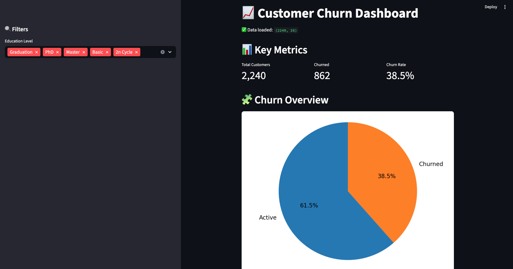
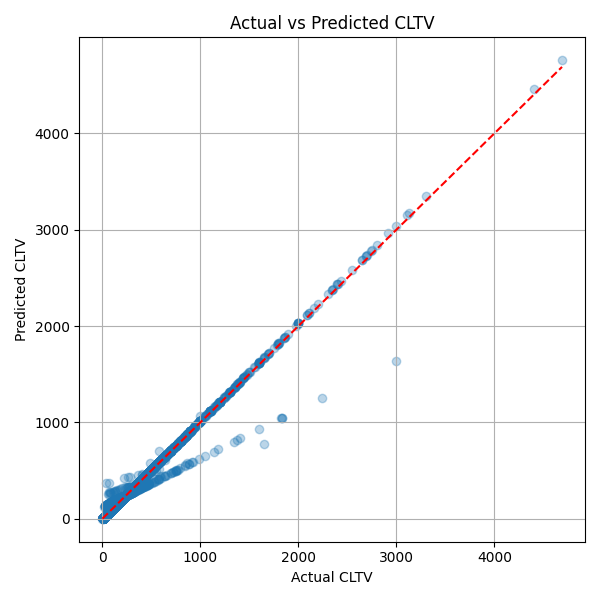

# E-Commerce Customer Analytics with dbt + DuckDB

This repo explores customer behavior and lifecycle analytics using two real-world datasets.  
Built using `dbt`, `DuckDB`, `Pandas`, and `scikit-learn` — with a focus on actionable insights and machine learning.

---

## Project 1: Customer Personality Churn Analysis

Using the [Customer Personality dataset](https://www.kaggle.com/datasets/imakash3011/customer-personality-analysis) to:

- Define churn using a recency threshold
- Analyze churn trends by demographic groups (age, income, education)
- Perform cohort analysis and retention breakdowns

### Notebooks

| Notebook | Description |
|----------|-------------|
| `01_explore_customer_data.ipynb` | Explore demographics, income, and education groupings |
| `02_churn_flag_and_retention.ipynb` | Engineer churn flag and analyze retention by segment |

### Streamlit Churn Dashboard Preview

A simple interactive dashboard built with Streamlit to visualize churn by:

- Age group
- Income group
- Education level
- Family size

File: `streamlit_apps/churn_dashboard.py`  
Preview:



---

## Project 2: Olist E-Commerce Analytics

Using the [Olist dataset](https://www.kaggle.com/datasets/olistbr/brazilian-ecommerce) to:

- Build a star schema using `dbt` models (`stg_`, `dim_`, `fct_`, `int_`)
- Analyze orders, revenue, freight costs, and customer behavior
- Train a machine learning model to predict **Customer Lifetime Value (CLTV)**

### Notebooks

| Notebook | Description |
|----------|-------------|
| `03_olist_cltv_modeling.ipynb` | Train a regression model to predict CLTV using features from `fct_orders` |

### CLTV Prediction (Linear Regression)

- Features: num_orders, avg_order_value, tenure_days, recency_days
- Model: `scikit-learn` Linear Regression
- R²: **0.985**, MAE: ~$4, RMSE: ~$25

Output:



---

## Tech Stack

| Layer          | Tool                  |
|----------------|------------------------|
| Modeling       | dbt + DuckDB          |
| Analysis       | Jupyter, Pandas       |
| ML             | scikit-learn          |
| Visualization  | Matplotlib, Streamlit |

---

## Project Structure

```
ecommerce-subscription-analytics/
├── analysis/
│   ├── 01_explore_customer_data.ipynb
│   ├── 02_churn_flag_and_retention.ipynb
│   └── 03_olist_cltv_modeling.ipynb
├── dbt_project/
│   └── models/
│       ├── personality/
│       └── olist/
├── outputs/
│   └── actual_vs_predicted_lr.png
├── screenshots/
│   └── churn_dashboard_preview.png
├── streamlit_apps/
│   └── churn_dashboard.py
├── requirements.txt
├── README.md
```

---

## How to Run

```bash
git clone https://github.com/melissa-nicholas/ecommerce-subscription-analytics.git
cd ecommerce-subscription-analytics

python3 -m venv venv
source venv/bin/activate
pip install -r requirements.txt

cd dbt_project
dbt build
```

---


## Author

**Built with ❤️ by Melissa Nicholas**  
Senior BI Engineer | Data Nerd | Dashboard Whisperer  
[Connect on LinkedIn](https://www.linkedin.com/in/melissa-nicholas-7a143593/)
